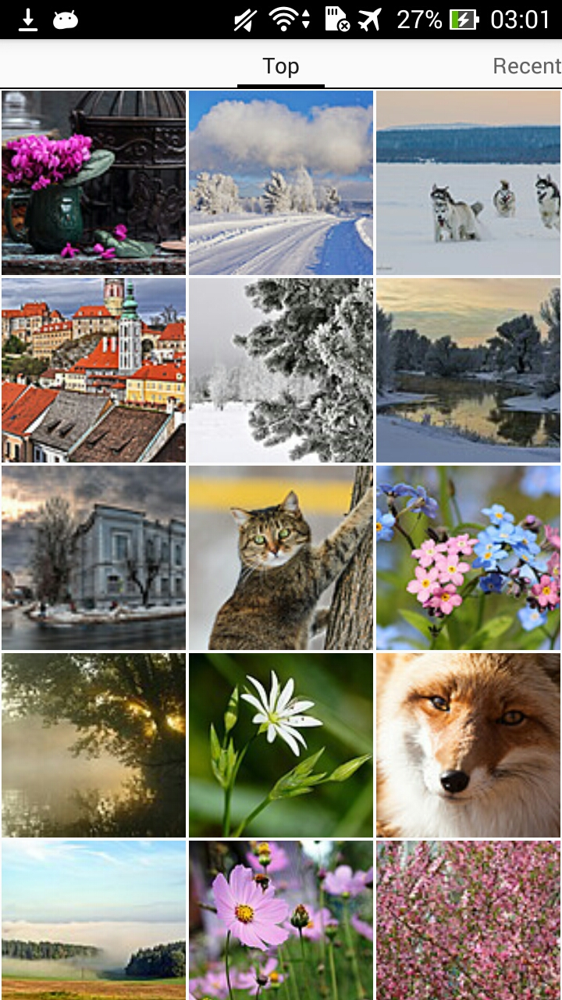
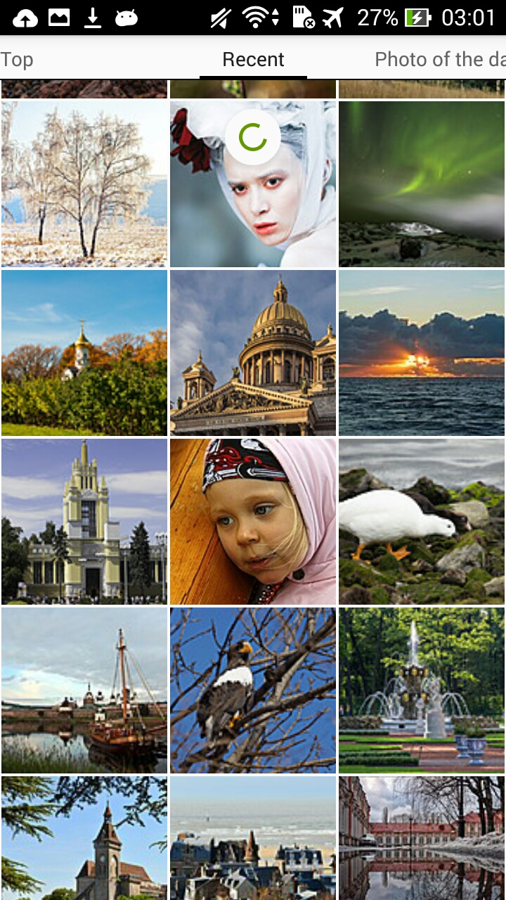
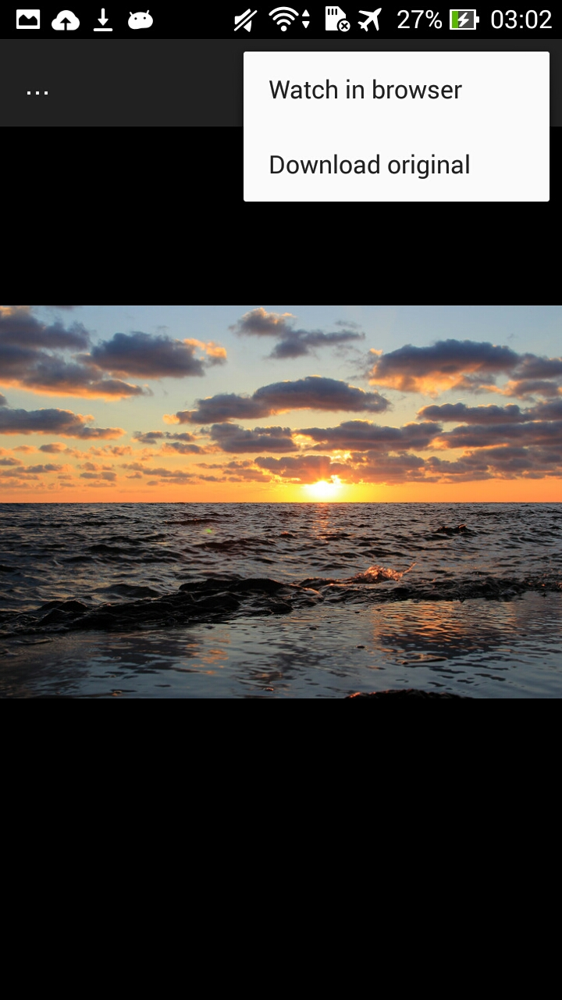

# Yandex Photos Client

## Description

[Yandex Photos](https://fotki.yandex.ru) client. Displays photos from three categories: __top__, __recent__ and __photo of the day__.

* Photos are displayed in GridView.
* Each photo can be viewed fullscreen and downloaded.
* Once loaded photos are stored offine.

More about task [here](./TASK.md)

## Apk
Ready to use [apk](./app/build/outputs/apk/app-debug.apk)

## Screenshots

!

